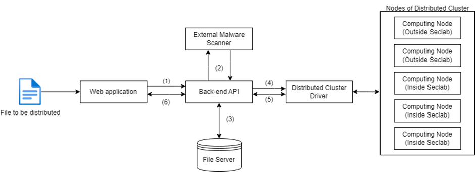

# Secure Distributed Computing Platform

*Project completed in Summer of 2024 for the Cyber Security specialization.*

A secure, scalable platform for distributed high-performance computing, allowing users to upload and execute compute-intensive tasks (e.g. password cracking, sudoku solving) across multiple internal/external nodes with strict security and monitoring.

## Overview

This platform enables secure distribution and execution of user programs across several computing nodes (local and remote). It includes web-based upload, task progress monitoring, file validation, and retrieval of results. Security and resource management are core priorities, preventing unauthorized use and ensuring code integrity.

## Key Features

- **Distributed Computing:** Tasks split across internal and external nodes for parallel execution.
- **Secure Upload and Execution:** Files are scanned for malware using ClamAV before distribution.
- **Role-Based Authentication:** Only authorized users can upload and execute jobs, via Auth0 integration.
- **Progress & Results Monitoring:** Real-time updates on task completion and results, accessible through the web.
- **Multi-OS & Location Support:** Nodes inside/outside Netlab, with VPN for secure remote connections.
- **Network Segmentation & Firewalling:** DMZ zones and OpenVPN isolate public, internal, and master node connectivity.
- **Static Code Analysis:** SonarQube integration scans code for vulnerabilities prior to deployment.

## Architecture and Workflow

- Web app (React + Tailwind) lets users authenticate, upload code, and view progress/results.
- Backend API (.NET) handles uploads, authorization, malware scanning, and communication.
- Files safely transferred via SFTP, and execution progress sent securely (WSS).
- Apache Spark orchestrates distribution and parallel execution of tasks.
- VPN ensures only trusted remote nodes join the cluster, maintaining data confidentiality.

## Technologies Used

- React, TailwindCSS (frontend)
- .NET Core (API)
- Apache Spark, Docker (distributed platform)
- Auth0 (authentication)
- ClamAV (malware scanning)
- SonarQube (code quality & security)
- OpenVPN, SFTP, HTTPS/WSS (network & data security)

## Functionality Summary

| Feature             | Description                                              |
|---------------------|---------------------------------------------------------|
| Upload program      | Users upload Python code for distributed execution      |
| Connect node        | Nodes (internal/external) securely join the cluster     |
| Task execution      | Code runs in parallel across multiple nodes             |
| Monitor progress    | See live updates and final results in web app           |
| Malware scanning    | Uploaded files scanned before deployment                |
| Auth control        | Role-based permissions restrict platform use            |
| Data protection     | VPN, SFTP, HTTPS, and DMZ for secure communication      |

## Research and Compliance

Follows NIST standards and cyber security best practices for distributed systems. Pentesting, regular code audits, and continuous threat assessment integrated during development.

## Contact

For questions, documentation requests, or contributions, please contact the repository owner.